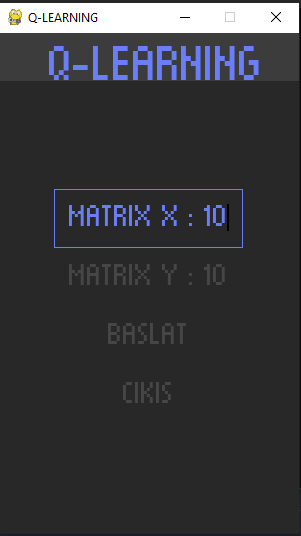
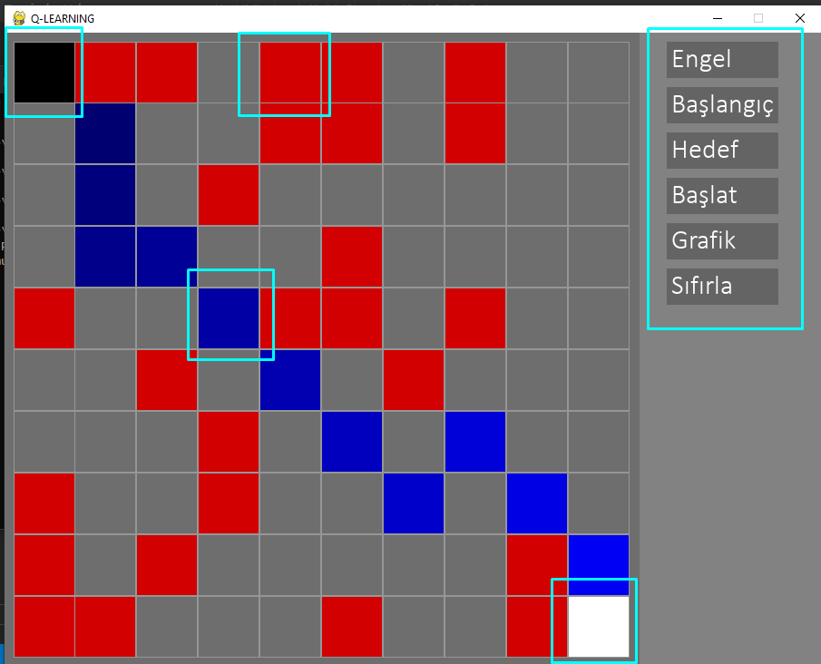
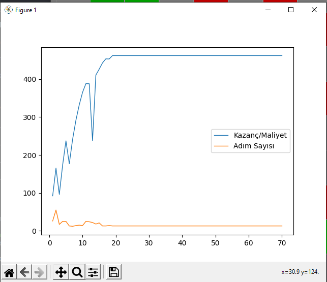

# [<< Kullanılan Paketler](Kullanılan%20Paketler.md)
# Nasıl Kullanılır

## Menü

1. **Matrix X** : Matrisinin genişlik değerini yönetebilirsiniz.
2.  **Matrix Y** : Matrisin yükseklik değerini yönetebilirsiniz.
3.  **Başlat** : Labirent üzerinde yol tespiti yapılacak uygulamayı başlatır.
4.  **Çıkış** : Projeyi sonlandırır.

## Oyun Ekranı

### Oyun Alanı (Harita)
1. **Gri Kare** : Yol olarak nitelendirilir.
2. **Siyah Kare** : Ajan olarak nitelendirilir.
3. **Beyaz Kare** : Hedef olarak nitelendirilir.
4. **Kırmızı Kare** : Engel olarak nitelendirilir.
5. **Mavi Tonlama** : Anlık olarak yolu göstermektedir.

### Sağ Menü

1. **Engel** : Engel seçeneği seçilerek ardından yol üzerine tıklanması durumunda yeni engel oluşturulur. Engel üzerine tıklandığında engel harita üzerinden kaldırılır.
2. **Başlangıç** : Başlangıç(Ajan)'ın harita üzerinde hangi konumda olacağını belirleyebilirsiniz. Harita üzerinde başlangıç(ajan) olmaması durumunda haritaya başlangıç(ajan) ekleyebilirsiniz. Varolan bir başlangıç(ajan)ın üzerine tıklayarak başlangıç(ajan)ı harita üzerinden kaldırabilirsiniz. **Harita üzerinde sadece bir adet başlangıç(ajan) eklenebilir.**
3. **Hedef** :  Hedef'in harita üzerinde hangi konumda olacağını belirleyebilirsiniz. Harita üzerinde Hedef olmaması durumunda haritaya hedef ekleyebilirsiniz. Varolan bir hedefin üzerine tıklayarak hedefi harita üzerinden kaldırabilirsiniz. **Harita üzerinde sadece bir adet hedef eklenebilir.**
4. **Başlat** : Pekiştirmeli öğrenme (Reinforcement learning)  algoritmasını başlatır. **Başlat butonuna basılması durumunda buton ismi Durdur olarak güncellenir.**
5.  **Durdur** : Pekiştirmeli öğrenme (Reinforcement learning)  algoritmasını durdurur.**Durdur butonuna basılması durumunda buton ismi Başlat olarak güncellenir.**
6.  **Grafik** : Pekiştirmeli öğrenme (Reinforcement learning)  algoritması sonucunda oluşan değerlerin grafiksel olarak gösterildiği pencereyi açar.
7.  **Sıfırla** : Haritayı sıfırlar.

## Grafik

1. **Kazanç/Maliyet** : Hedefe ulaşan yollar içerisinde kazanç/maliyet değerlerini grafiksel olarak gösterir.
2. **Adım Sayısı** : Hedefe ulaşan yollar içerisinde hedefe ulaşmak için sarf edilen adım sayısını gösterir.

# [>> Sonuç](Sonuç.md)

