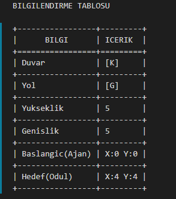
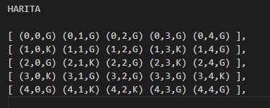

# [<< Nasıl Kullanılır](Nasıl%20Kullanılır.md)

# Sonuç
Uygulama çalıştırıldığın da işlemlerin sonucunda bulunan yol ve harita bilgileri result.txt dosyası içerisinde kayıt edilmektedir.

## Bilgilendirme Tablosu

Dosya içerisinde bulunan kavramların sembolünü gösteren tablodur.

## En Kısa Yol

Bulunan en kısa yolun baştan sona tüm adımlarının listelendiği tablodur.

## Harita

Labirentin haritasının yazılı olarak yansıtıldığı ekrandır.

# [>> Kaynakça](Kaynakça.md)
