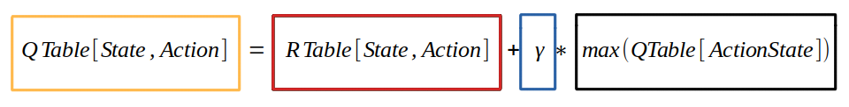

# [<< Giriş](Giriş.md)
# Yöntem

## Pekiştirmeli Öğrenme (Reinforcement learning) Yaklaşımı
Pekiştirmeli öğrenmede ajan (agent) adı verilen öğrenen makinemiz karşılaştığı durumlara bir tepki verir ve bunun karşılığında da sayısal bir 
ödül sinyali alır. Ajan/öğrenen makine aldığı bu ödül puanını maksimuma  çıkartmak için çalışır. Bu şekilde çalışan deneme yanılma yöntemi (brute force), pekiştirmeli öğrenmenin en ayırt edici özelliğidir.

>  Pekiştirmeli öğrenme bir problem hakkında çalışma ve çözüm yöntemidir.

## Görsel  Üzerinden Formül İncelemesi

**State:** Ajanın o anki bulunduğu konum  
**Action:** Ajanın seçtiği yöndeki hareket  
**ActionState:** Ajanın seçtiği yöndeki hareketi sonucu bulunduğu yeni konum  

1. **Turuncu Alan** : Ajanın bulunduğu durumdan seçilen yöndeki hareket sonucu formüle göre elde edilen kazanç değerinin güncelleneceği alan.
2. **Kırmızı Alan** : R tablosundaki durum ve seçilen yöndeki ajanın geçiş yapmaya çalıştığı durumun incelendiği, hedefe mi, duvara mı ya da hareket edilebilir bir yolda mı olduğunun bilgisi edinilen ve bu hareket sonucu elde edilen kazanç değeri.
3. **Mavi Alan** : Ajanın yolu öğrenme oranı. Bu oran sayesinde ajanın bir sonraki hamlesinden elde etmesi gereken kazanç azaltılıp, arttırılabilir. Oran azaltıldığında ajan kısa vadede en karlı yolu takip eder. Oran arttırıldığında ajan uzun vadeli ödülleri hedefler.
4. **Siyah Alan** : Ajanın seçtiği yöndeki durumdan bir sonraki hamlede gidebileceği tüm durumlardan q tablosundaki değeri en yüksek olan durumun değerini ifade eder.

# [>> Kullanılan paketler](Kullanılan%20Paketler.md)

